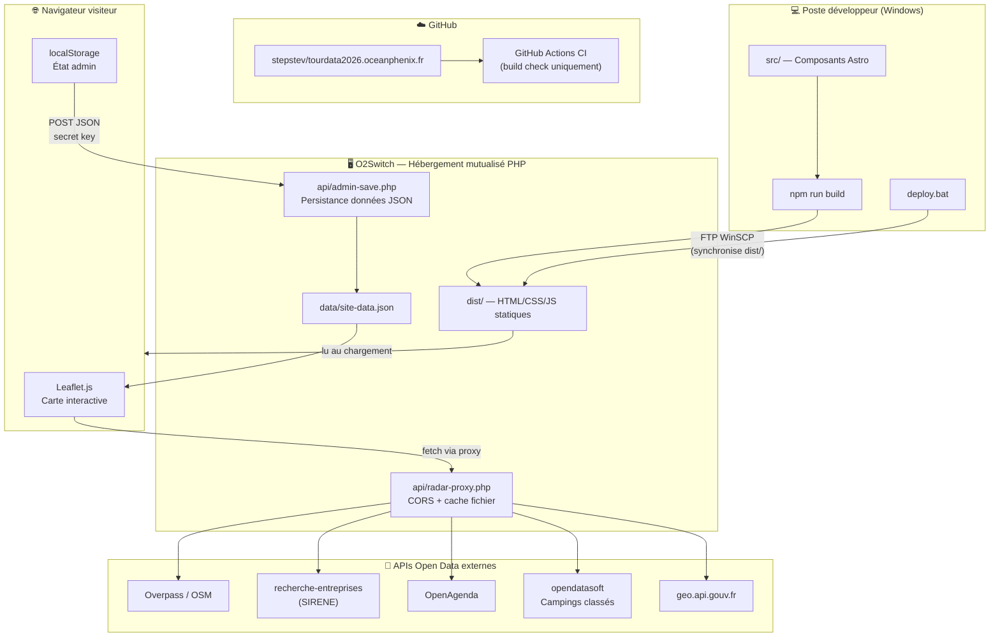
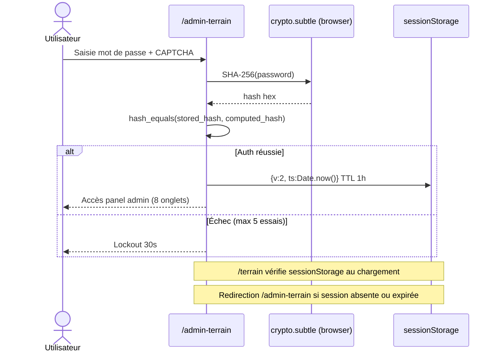
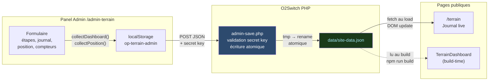
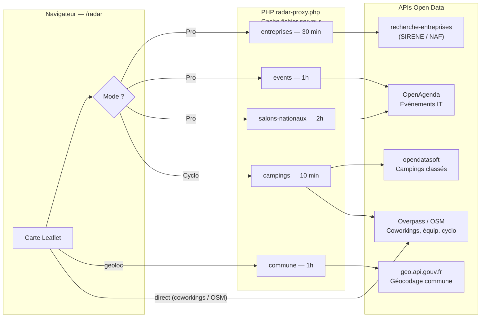
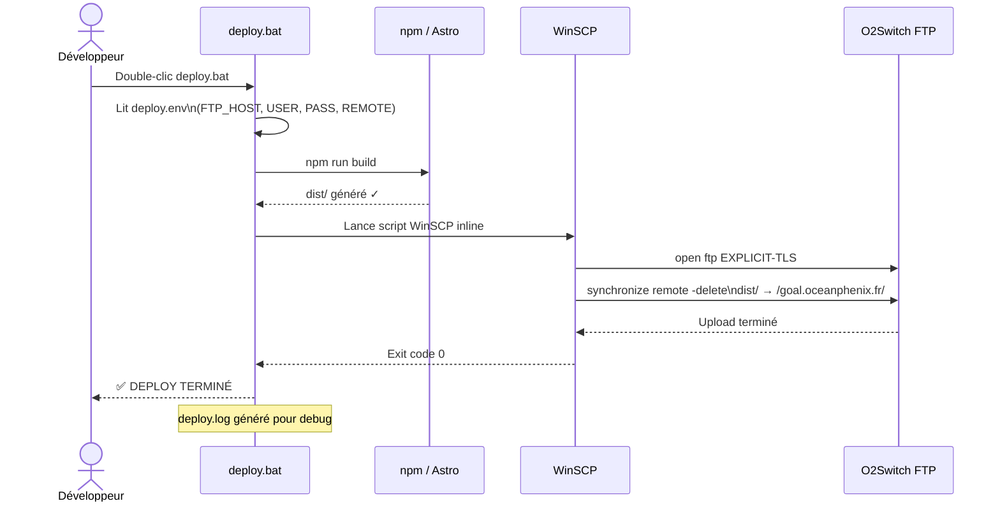
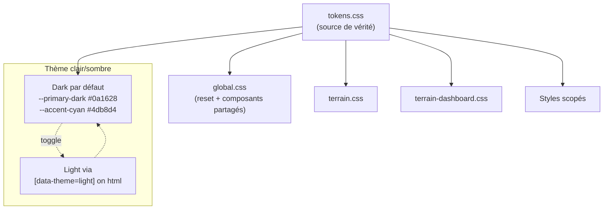

# OceanPhenix™ — TourData 2026

> **OceanPhenix™** · Data Product Management · Business Intelligence · Observabilité · Innovation IA

Site vitrine et plateforme de suivi terrain pour **TourData 2026** — un parcours cyclo professionnel (~3 150 km, 14 étapes, Avril–Juillet 2026) croisant exploration terrain, open data et recrutement Data / IT.

**Production :** [tourdata2026.oceanphenix.fr](https://tourdata2026.oceanphenix.fr)

---

## Vue d'ensemble — Architecture système



---

## Stack technique

| Couche | Technologie | Rôle |
| ------ | ----------- | ---- |
| Framework | [Astro v4](https://astro.build) (SSG) | Génère du HTML statique pur au build — zéro JS serveur |
| CSS | Design tokens + CSS custom properties | `tokens.css` = source de vérité, styles scopés par page |
| JS | Vanilla JS | Zéro framework front — maps, auth, admin, live sync |
| Carte | [Leaflet.js](https://leafletjs.com) + MarkerCluster (local) | Rendu carte OSM, GPX, coworkings, campings |
| APIs | Overpass, SIRENE, OpenAgenda, opendatasoft | Open data terrain : pros, cyclo, événements |
| Proxy | PHP 8 `radar-proxy.php` | Évite CORS, met en cache les réponses API |
| Admin backend | PHP 8 `admin-save.php` | Persiste `site-data.json`, valide secret key |
| Hébergement | O2Switch mutualisé | Supporte PHP — GitHub Pages incompatible |
| Déploiement | `deploy.bat` + WinSCP FTP | Build Astro → sync `dist/` vers sous-domaine O2Switch |
| Fonts | Inter (Google Fonts) | Typographie principale |
| Icons | Font Awesome 6.5 CDN | Icônes interface |

---

## Structure du projet

```text
.
├── src/
│   ├── components/            # Composants Astro réutilisables
│   │   ├── Nav.astro          # Navigation glassmorphism (auth-aware)
│   │   ├── Hero.astro         # Section hero + CTA
│   │   ├── TerrainDashboard.astro  # Dashboard stats (build-time JSON)
│   │   ├── CvSection.astro    # Business card + social links
│   │   ├── Footer.astro
│   │   ├── OceanBackground.astro   # Waves CSS animées
│   │   ├── AboutModal.astro / CguModal.astro / WelcomePopup.astro
│   │   └── ThemeHint.astro    # Toast hint dark/light
│   ├── layouts/
│   │   └── BaseLayout.astro   # Layout SEO : OG, Twitter Card, canonical, JSON-LD
│   ├── pages/
│   │   ├── index.astro        # Accueil
│   │   ├── portfolio.astro    # Vitrine profil
│   │   ├── expertises.astro   # Domaines Data / BI / IA
│   │   ├── tourdata.astro     # Concept TourData 2026
│   │   ├── etapes.astro       # Planning 14 étapes cyclo
│   │   ├── terrain.astro      # Journal terrain live (auth-gardé)
│   │   ├── radar.astro        # Radar Pro/Cyclo — carte open data
│   │   ├── strava.astro       # Activités Strava
│   │   ├── rag-2026.astro     # Demo RAG Platform IA
│   │   ├── admin-terrain.astro # Panel admin 8 onglets (auth SHA-256)
│   │   └── 404.astro
│   ├── data/
│   │   └── terrain-etapes.json # Source de vérité build-time (14 étapes)
│   └── styles/
│       ├── tokens.css         # Variables CSS : couleurs, typo, spacing, ombres
│       ├── global.css         # Reset + composants partagés
│       ├── terrain.css        # Styles page terrain
│       └── terrain-dashboard.css
│
├── public/
│   ├── api/
│   │   ├── admin-save.php     # Endpoint persistance JSON (secret key)
│   │   ├── radar-proxy.php    # Proxy CORS + cache APIs externes
│   │   └── strava.php         # Proxy activités Strava
│   ├── js/
│   │   ├── admin-terrain.js   # Logique panel admin complet
│   │   ├── terrain-maps.js    # Init Leaflet + markers + GPX + coworking
│   │   ├── terrain-live.js    # Sync localStorage → DOM (page terrain)
│   │   ├── main.js            # Theme toggle, scroll, modal, load time
│   │   ├── theme-init.js      # Anti-FOUC (chargé inline dans <head>)
│   │   └── theme-hint.js      # Toast hint thème clair
│   ├── lib/                   # Librairies JS/CSS locales (offline-safe)
│   │   ├── leaflet.min.js / leaflet.min.css
│   │   └── leaflet.markercluster.min.js / MarkerCluster*.css
│   ├── gpx/                   # Traces GPX des étapes
│   └── Images/                # Assets visuels
│
├── deploy.bat                 # Script déploiement Windows (WinSCP FTP)
├── deploy.env.example         # Template identifiants FTP (ne pas commiter)
├── astro.config.mjs
└── package.json
```

---

## Pages et routing

| Route | Fichier | Accès | Description |
| ----- | ------- | ------ | ----------- |
| `/` | `index.astro` | Public | Accueil — Hero, présentation TourData 2026 |
| `/portfolio` | `portfolio.astro` | Public | Vitrine profil — parcours, compétences |
| `/expertises` | `expertises.astro` | Public | 6 domaines d'intervention Data / BI / IA |
| `/tourdata` | `tourdata.astro` | Public | Concept TourData 2026 |
| `/etapes` | `etapes.astro` | Public | Planning 14 étapes cyclo (carte + dates) |
| `/terrain` | `terrain.astro` | Auth | Journal terrain live (positions, photos, GPX) |
| `/radar` | `radar.astro` | Public | Radar Pro/Cyclo — carte interactive open data |
| `/strava` | `strava.astro` | Public | Métriques Strava |
| `/rag-2026` | `rag-2026.astro` | Public | Demo RAG Platform IA 2026 |
| `/admin-terrain` | `admin-terrain.astro` | Admin | Panel admin 8 onglets (auth SHA-256 + CAPTCHA) |
| `/404` | `404.astro` | — | Page d'erreur personnalisée |

---

## Flux d'authentification admin



---

## Flux de données terrain (admin → site public)



---

## Architecture Radar — sources open data



---

## Pipeline de déploiement



---

## Design system CSS



**Conventions CSS :**
- `tokens.css` — variables globales (couleurs, typographie, espacements, ombres, border-radius)
- `global.css` — reset, layout nav/hero/footer, composants modaux
- Chaque page `.astro` encapsule ses styles dans `<style>` (scopé par Astro automatiquement)
- Thème persisté en `localStorage['op-theme']`

---

## Persistance des données (localStorage)

| Clé | Contenu | Écrit par |
| --- | ------- | --------- |
| `op-terrain-admin` | État complet terrain (étapes, journal, photos, position, compteurs) | Panel admin |
| `op-terrain-gpx` | Fichiers GPX uploadés (XML inline) | Admin — onglet GPX |
| `op-terrain-coworking` | Espaces coworking (lat, lng, nom, visible) | Admin — onglet Coworking |
| `op-theme` | `"light"` ou absent (dark par défaut) | theme-init.js |
| `op-theme-hint-seen` | Boolean — hint thème déjà affiché | theme-hint.js |

---

## Page Radar — détail des sources

| Source | Mode | Type de données | Cache |
| ------ | ---- | --------------- | ----- |
| [Overpass / OSM](https://overpass-api.de) | Pro + Cyclo | Coworkings, campings OSM, équipements cyclo | Direct |
| [opendatasoft](https://public.opendatasoft.com) | Cyclo | Campings classés officiels | 10 min |
| [recherche-entreprises.api.gouv.fr](https://recherche-entreprises.api.gouv.fr) | Pro | Entreprises par code NAF + département | 30 min |
| [OpenAgenda](https://openagenda.com) | Pro | Événements IT locaux + salons nationaux | 1–2 h |
| [geo.api.gouv.fr](https://geo.api.gouv.fr) | Commun | Résolution commune depuis lat/lon | 1 h |

Variable d'environnement serveur :
```
OPENAGENDA_KEY=votre_clé_openagenda
```

---

## Développement local

```bash
npm install        # Installer les dépendances (Node 20+)
npm run dev        # Dev server → http://localhost:4321
npm run build      # Build production → dist/
npm run preview    # Prévisualiser dist/ en local
```

> **Note :** Le proxy PHP (`radar-proxy.php`, `admin-save.php`) ne s'exécute qu'en production sur O2Switch.  
> En dev, les appels API se font directement depuis le navigateur. Le bouton **Publier tout** retourne une erreur attendue (PHP non disponible).

---

## Déploiement

### Automatique — recommandé

```bat
deploy.bat
```

1. Lit `deploy.env` → identifiants FTP
2. Lance `npm run build` (Astro SSG)
3. Synchronise `dist/` → O2Switch via WinSCP FTP (mode passif + TLS explicite)
4. Génère `deploy.log` pour debug

### Configuration FTP (`deploy.env`)

```env
# Copier depuis deploy.env.example — ne jamais commiter ce fichier
FTP_HOST=ftp.oceanphenix.fr
FTP_USER=votre_login_cpanel
FTP_PASS=votre_mot_de_passe_ftp
FTP_REMOTE=/goal.oceanphenix.fr/   # Dossier cible sur O2Switch
```

> `FTP_REMOTE` = chemin du sous-domaine sur O2Switch (`/goal.oceanphenix.fr/`, `/tourdata2026.oceanphenix.fr/`, etc.)  
> Utiliser `/public_html/` uniquement pour le domaine nu `oceanphenix.fr`.

### CI GitHub Actions

Le workflow `.github/workflows/deploy.yml` vérifie uniquement que le build Astro passe.  
Il ne déploie pas (O2Switch PHP incompatible avec GitHub Pages).

---

## SEO

- Open Graph + Twitter Card sur toutes les pages via `BaseLayout.astro`
- Canonical URL par page
- JSON-LD `Person` schema sur `/portfolio`
- `robots.txt` et `sitemap.xml` statiques dans `public/`

---

## Branches

| Branche | Usage |
| ------- | ----- |
| `main` | Production — code stable, CI vérifie le build |
| `dev` | Développement actif |

---

## Licence

PROPRIÉTAIRE — TOUS DROITS RÉSERVÉS

| Élément | Statut |
| ------- | ------ |
| Code source | Usage privé uniquement |
| Concept & design | Protégé — reproduction interdite |
| Marque OceanPhenix™ | Marque déposée |

---

[tourdata2026.oceanphenix.fr](https://tourdata2026.oceanphenix.fr)
